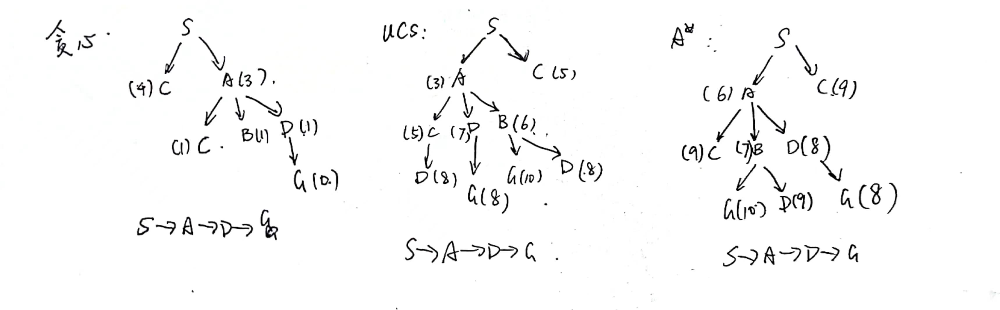

# 
Homework1

##### 
刘喆骐     2020013163    探微化01

## T1
###### (1)
深度优先搜索（DFS）的时间复杂度为$O(d^n)$，空间复杂度为$O(nd)$。
宽度优先搜索（BFS）的时间复杂度为$O(d^n)$，空间复杂度为$O(d^{n})$。

###### (2)
图搜索旨在解决在具有环路和重复状态的图结构中寻找路径的问题。图搜索算法在搜索过程中需要维护一个已访问的节点集合，以避免无限循环和重复状态。

###### (3)
对于一个CSP，其有n个变量，每个变量domain大小最多为d，最多有c个约束，那么最坏的时间复杂度为$O(c*d*d^2)=O(cd^3)$.
推导：上式中c表示每个边的约束，d表示最多要插入队列d次，因为$X_i$最多有d个元素要删除。$d^2$是执行arc-consistency的耗时。

###### (4)

模拟退火算法的基本思路是在搜索过程中以一定的概率接受劣解，以避免局部最优解。在搜索开始时，模拟退火算法会根据初始状态和温度参数，产生一个随机解作为当前解。然后，模拟退火算法在解空间中进行搜索，每次产生一个新的解，并计算出新解和当前解之间的差异。如果新解比当前解更优，则直接接受新解；否则以一定的概率接受新解，接受劣解的概率随着温度的降低而逐渐减小。

## T2

## T3
$f(T)=g(T)+W*h(T)=g(T)$
$f(S)=g(S)+W*h(S)=W*h(S)$
当加权${A^*}$搜索算法终止时，最优目标$T^*$的祖先n在边缘集上。由于T在n之前被加入expanded集，故 $f(T) ≤ f(n)$. 故

$g(T) = f(T) ≤ f(n) = g(n) + Wh(n) ≤ W (g(n) + h(n)) ≤ W h^∗(S)$

