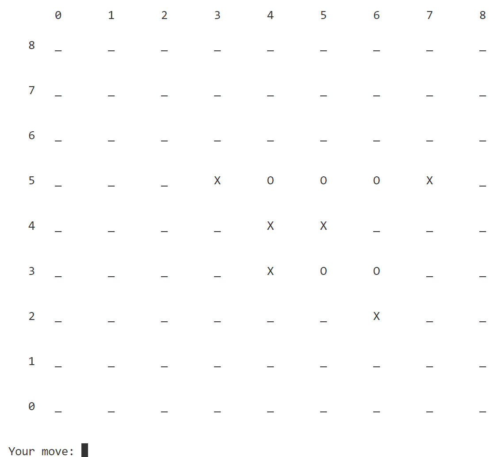

# 
Homework1 report

##### 
刘喆骐     2020013163    探微化01

### 1. AI 表现
##### 1. Minmax search
$\qquad$在3*3的井字棋中ai能够寻找到不输策略。如下图所示。

图1 人-机器

图2 机器-人

##### 2. Alpha-Beta search
$\qquad$在4*3的棋盘中，alpha-beta search能够较快的行棋并且找到先手必胜的策略。

图3 alpha-beta-人

##### 3. Alpha-Beta Cutting off search
$\qquad$前三种搜索在大棋盘中会表现处糟糕的结果，而剪枝算法能够得到较好的结果，能够较快的做出决策并且体现出智能，例如会进攻和防御。如下图所示，它能够主动进攻，防御活三、冲四。

图4 防御活三

图5 防御冲四

让两个剪枝算法对抗，能够得到较好的结果，将棋盘填满，和棋。

图6 剪枝对抗

##### 4. MCTS search
$\qquad$MCTS搜索产生的结果主要是非常随机，并且行棋速度较慢，这是由于其随机选择节点所致。但是相较于Minxmax而言，其速度依旧较快。
MCTS和minmax对战结果如下：

图7 MCTS-minmax

##### 5. Alphazero search
$\qquad$结果较好，其行棋具有一定的智能，和alpha beta剪枝类似。和人类行棋有较好的结果。但是其对于斜线连珠的防御不足，此局我获胜就是使用斜线，制造了两个活三，进而获胜。而下面一局alphazero构造了活三和冲四，进而获胜。

图8 人-alphazero

图8.1 alphazero-human

##### 6. AI 比较
$\qquad$行棋较好的两个是Alphazero和Alpha_Beta_cuttingoff，将这两者进行对战，得到如下结果：

图9 alphazero-剪枝

棋盘填满，最终和棋，活三等得到防御，两者都会主动进攻。程序运行时间较长，两者水平接近，但是alphazero耗时略长。
### 2. alpha-beta搜索和朴素minimax搜索
$\qquad$在4*3的棋盘中进行比较。
alpha-beta搜索耗时：4s。
朴素minimax搜索耗时：运行超过13min没有结果。
说明alpha-beta搜索更加高效。

###3. 评估函数设计方案
$\qquad$针对不同的行棋方设定不同的评估函数。当p=player时，分数1=活四×10000 + 冲四×10000 + 活三×10000 + 冲三×50 + 活二×10 - 最大距离，如有两个活三，加10000分。p!=player时，分数2=活四×10000 + 冲四×700 + 活三×700 + 冲三×40 + 活二×10 - 最大距离，如有两个活三，加10000分。返回时进行归一化，使得返回值在[-1,1]之间。

###4. MCTS与alpha-beta搜索的对战结果与分析
$\qquad$MCTS的效果很差，接近于随机，不会对活三、冲四等进行防御。而alpha-beta剪枝行棋不随机，会使用活三等进攻，符合五子棋行棋规律，较为合理。

图10 MCTS-剪枝

###5. MCTS和AlphaZero的对比
$\qquad$Alphazero行棋更加合理，不像MCTS那样随机。在c值较小(0.01)时，MCTS依旧较为随机，不会进攻和防御，而Alphazero行棋合理，会主动进攻。如下图，Alphazero直接连成5子获胜，而MCTS接近随机行棋。

图11 Alphazero-MCTS
