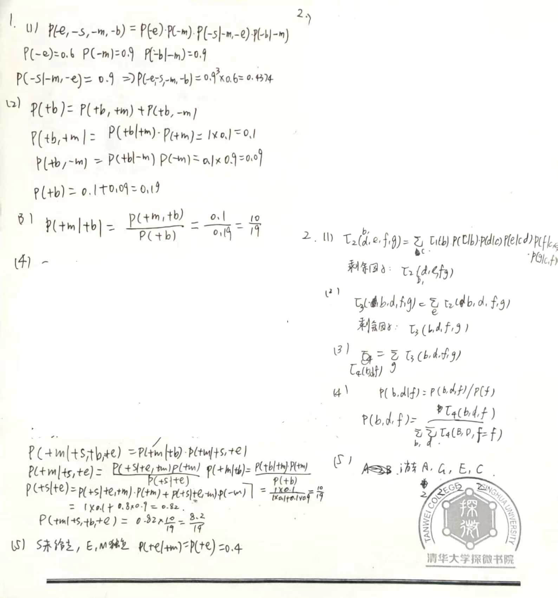
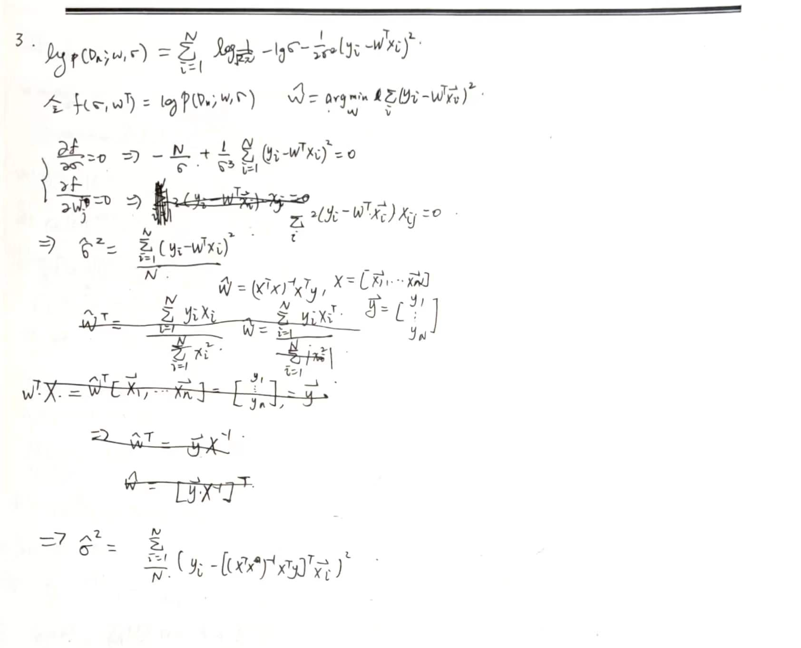
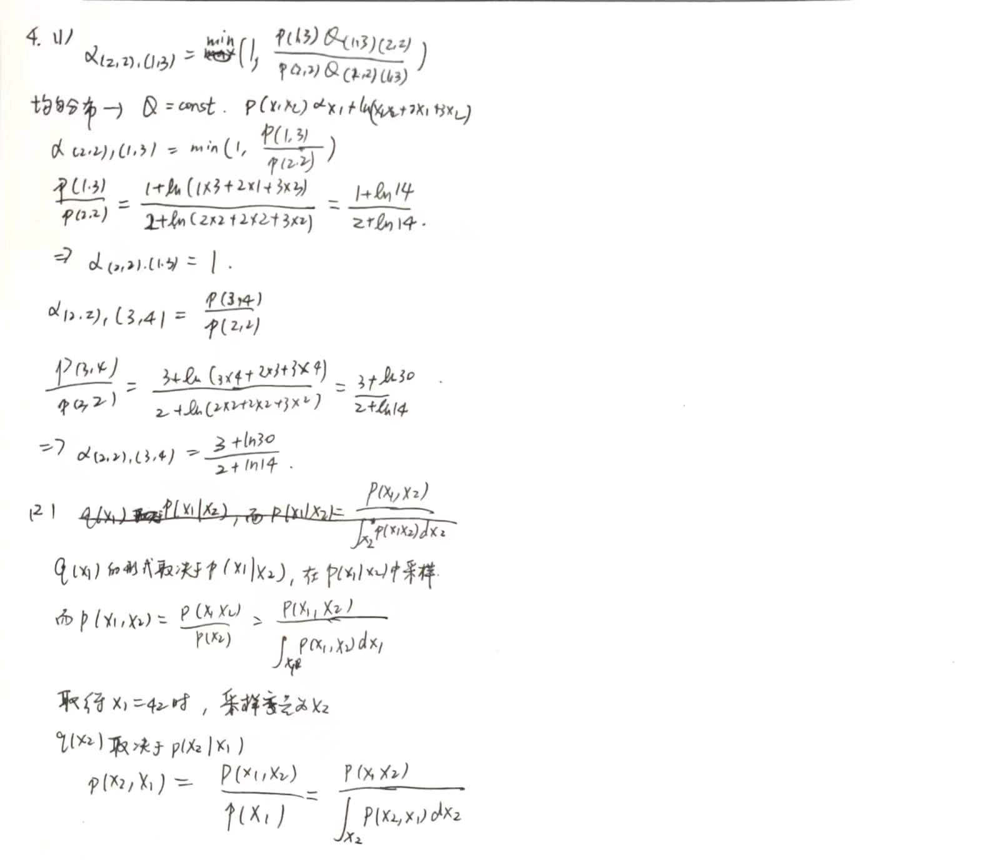
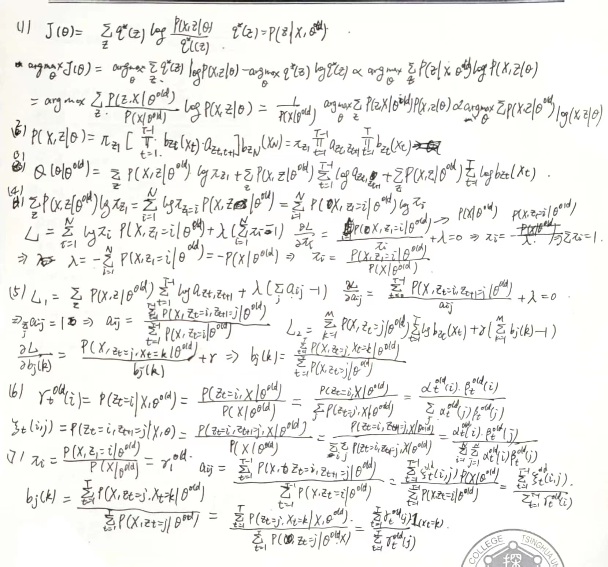
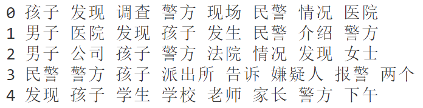
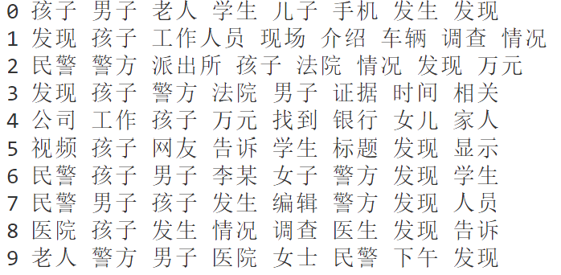
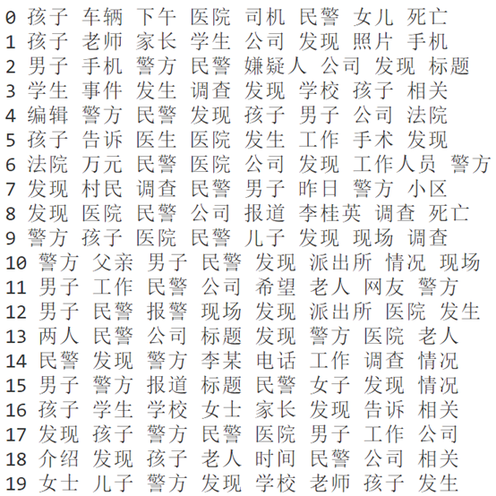

# <center>Homework3

##### <center>刘喆骐     2020013163    探微化01

<style>
     img[alt="0"]{
        width:400px;
    }
    img[alt="1"]{
        width:600px;
    }
</style>


## 1 and 2
<center>

</center>

## 3
<center>

</center>
## 4
<center>

</center>
## 5
<center>

</center>
伪代码如下：

```python
def Baum-Welch(X, pi, A, B, pi_old, A_old, B_old, max_iter)    
    model.init(pi_old, A_old, B_old)
    for i inrange(max_iter):        
        alpha = model.forward(X)        
        beta = model.backward(X)        
        gamma = model.compute_gamma(alpha, beta)        
        xi = model.compute_xi(alpha,beta)        
        pi = model.compute_p(gamma)        
        A = model.compute_a(gamma, xi)        
        B = model.compute_b(gamma)  
        model.update(pi, A, B)
        return model
```


## 6
(a)
$\qquad$伪代码如下：
```python
def VariationalEM(text,max_iter)    
    docs, vocab = Preprocess(text)    lda_model = LDA()    
    lda_model.fit(docs, vocab, max_iter)    
    init_parameters()
    while (i < max_iter and delta < tolerance)
        for doc in docs:            
            update_phi(doc)             
            update_gamma(doc)   
        update_log_beta()        
        update_alpha()
        prev_bound = bound   
        update_bound()        
        delta = 1- bound / prev_bound    
    print_results()
```
(b)
$\qquad$见代码文件
(c)
分别取K=5,10,20,结果如下：

K=5
<center>

</center>
K=10
<center>

</center>
K=20
<center>

</center>
(d)
$\qquad$最好的K为10。当K过小时，分类的主题数小于真实的主题数，导致部分主题缺失，对应欠拟合。而K过大时，分类的主题数大于真实的主题数，使得相同主题反复出现以及无关词被组合成一个主题，对应过拟合。于是K过大和过小都不好。

