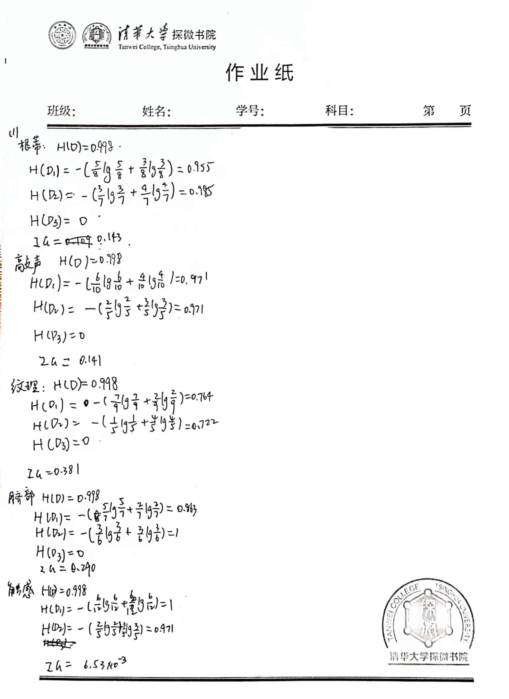
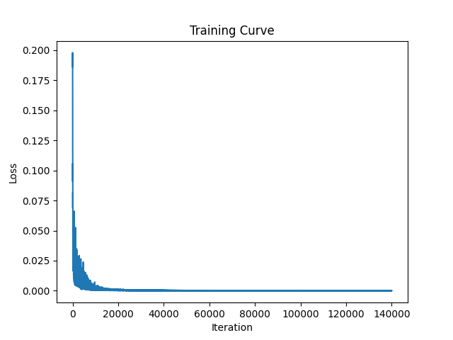

# 
Homework2

##### 
刘喆骐     2020013163    探微化01
##1
(1)

$\qquad$模型可能会发生过拟合。

$\qquad$区别：验证集用于进一步确定模型中的超参数，即调整模型的结构和参数，以提高模型的泛化能力；而测试集则是用来评估模型的泛化能力，即模型对未知数据的预测能力。

(2)

$\qquad$将数据集分成K份，每次拿出一份作为验证集，剩下k-1份作为训练集。重复K次，每次选择不同的验证集，最后将K次的结果取平均。

(3)

$\qquad$L1正则化可以产生稀疏权值矩阵，即产生一个稀疏模型，将一些权重减为0，可以用于特征选择.
$\qquad$弹性网络正则化是一种结合了L1和L2正则化的方法，它同时惩罚权重系数的绝对值和平方值，可以用于特征选择和防止过拟合。弹性网络的优化目标是：$\mathop{min}\limits_{w} \frac 1{2n}​||Xw−y||_2^2
​+αρ||w||_1​+2α(1−ρ)​||w||_2^2​$

(4)

$\qquad$引入核函数的动机：在低维空间中，数据可能是线性不可分的，但是在高维空间中，数据可能是线性可分的。因此，我们可以通过核函数将数据从低维空间映射到高维空间来解决这个问题。

(5)

1. 自助采样法: 对于每棵树, 从原始数据集中有放回地随机抽取相同大小的样本。
2. 随机选择特征: 在每个节点进行分裂时, 从所有特征中随机选择一定数量的特征作为候选特征。
##2
(1)
$\qquad$增加训练数据量，减少模型的复杂度。
$\qquad$正则化.
$\qquad$Dropout：在训练过程中随机删除一些神经元。
$\qquad$Early stopping：在训练过程中，当验证集上的误差不再下降时停止训练。

(2)

$\qquad$平移不变性和局部性。局部性是指图像中的每个区域只与其周围的一小部分区域相关，而平移不变性是指图像中的特征在不同位置上具有相同的意义。

(3)

$\qquad$LeNet 共有卷积层 (C1), 池化层 (S2), 卷积层 (C3), 池化层 (S4), 全连接层 (F5), 全连接层(F6), 输出层 (F7) 共 7 层, 其中包含可学习参数的层为:C1、C3、F5、F6 和 F7。
$\qquad$不考虑偏置参数, 这些层的可学习参数量分别为:
$\qquad$C1 : 6×5×5 = 150
$\qquad$C3 : 16×5×5 = 400
$\qquad$F5 : 120×(16×5×5) = 48000
$\qquad$F6 : 84×120 = 10080
$\qquad$F7 : 10×84 = 840

(4)

$\qquad$ResNet在模型架构上提出了残差学习的思想，即在网络中增加了跨层连接，使得网络可以更深，同时避免了梯度消失的问题。

(5)

$\qquad$gradient clipping：梯度大于某阈值时进行裁剪，使之不大于该阈值。
$\qquad$Variational Dropout：在每个时间步丢弃相同的网络单元，随机丢弃输入、输出和循环连接。

##3

## 4

(1)  

$l=-log(\frac {e^{o_k}}{\sum_{j=1}^K e^{o_j}})=-o_k+log(\sum_{j=1}^K e^{o_j})$
当$i \not ={k}$时，

${\partial l\over {\partial o_i} }= {\partial log(\sum_{j=1}^K e^{o_j})\over {\partial o_i} }=\frac {e^{o_i}}{\sum_{j=1}^K e^{o_j}}$

当$i ={k}$时，

${\partial l\over {\partial o_i} }=-1+{\partial log(\sum_{j=1}^K e^{o_j})\over {\partial o_i} }=-1+\frac {e^{o_i}}{\sum_{j=1}^K e^{o_j}}$

故

${\partial l\over {\partial o} }=(\frac {e^{o_1}}{\sum_{j=1}^K e^{o_j}},\frac {e^{o_2}}{\sum_{j=1}^K e^{o_j}},...,\frac {e^{o_{k-1}}}{\sum_{j=1}^K e^{o_j}},\frac {e^{o_k}}{\sum_{j=1}^K e^{o_j}},\frac {e^{o_{k+1}}}{\sum_{j=1}^K e^{o_j}},...\frac {e^{o_K}}{\sum_{j=1}^K e^{o_j}})$
${\partial l\over {\partial o} }=\hat{y}-y$

(2)

(2.1)

$\frac {\partial l}{\partial W}=\frac {\partial l}{\partial o}\frac {\partial o}{\partial W}$
$o=W^Tx, o_i=\sum_{j=1}^D W_{ij}x_j $

故

$\frac {\partial o_i}{\partial W_{ij}}=x_j$
$\frac {\partial l}{\partial W_{ij}}=\sum_{k=1}^K\frac {\partial l}{\partial o_k}\frac {\partial o_k}{\partial W_{ij}}=(\hat {y_i}-y_i)x_j^T$

故

$\frac {\partial l}{\partial W}=x(\hat {y}-y)^T$

(2.2)

$\frac {\partial l}{\partial x}=\frac {\partial l}{\partial o}\frac {\partial o}{\partial x}$

$\frac {\partial o_i}{\partial x_j}=W_{ij}$
$\frac {\partial l}{\partial x_j}=\sum_{k=1}^K\frac {\partial l}{\partial o_k}\frac {\partial o_k}{\partial x_{j}}=\sum_{k=1}^K(\hat{y_k}-y_k)W_{kj}$

故

$\frac {\partial l}{\partial x}=W(\hat{y}-y)$

(3)

$\frac {\partial h_i}{\partial z_i}=\frac {\partial \frac 1 {1+e^{-z_i}}}{\partial z_i}=\frac {e^z_i}{{(1+e^z_i)}^2}=h_i(1-h_i)$
$\frac {\partial l}{\partial z}=[\sum_{j=1}^H \frac{\partial l}{\partial h_j}\frac{\partial h_j}{\partial z_j}]_{i=1}^H=[h_i(1-h_i)W_2(\hat{y}-y)]_{i=1}^H=h ⊙ (1 − h) ⊙ W_2(\hat{y} − y)
$
$\frac {\partial l}{\partial W_1}=\frac {\partial l}{\partial z}\frac {\partial z}{\partial W_1}$
$z_i=\sum_{j=1}^DW_{1ij}x_j$

故

$\frac {\partial z_i}{\partial W_{1ij}}=x_j$
$\frac {\partial l}{\partial W_{1ij}}=\sum_{k=1}^H\frac {\partial l}{\partial z_k}\frac {\partial z_k}{\partial W_{1ij}}=h_i(1−h_i)(W_2(\hat{y}−y))_ix_i$

故

$\frac {\partial l}{\partial W_1}=x[h⊙ (1−h)⊙W_2(\hat{y}−y)]^T$

(4)

loss 图

最佳选择：hidden_dim=75, lr=0.005, batch_size=64, epochs=1000

结果：训练集准确率1，验证集准确率0.959，测试集准确率0.9502