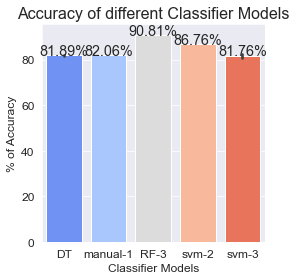
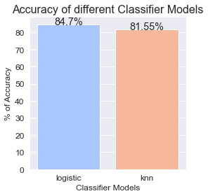

# 
Report

##### 
刘喆骐     2020013163    探微化01

####(1)Data Processing
$\qquad$先使用lower将字母转化为小写，然后用re.sub(r'[^a-zA-Z0-9\s]','',text)，将字母和数字保留。

#### (2)Rebuild
$\qquad$构造tf-idf方法.在__init__中初始化类的tokenizer和stop_words属性，以及后面计算的word_idf和vocab属性。
$\qquad$在_compute_idf函数中计算语料库中每个单词的 IDF。它首先通过遍历所有文本并计算每个单词在每个文本中出现的次数来计算每个单词的文档频率 (DF)。 然后，它通过取语料库中文档总数除以单词的 DF 的对数来计算每个单词的 IDF。最后，它将 IDF 值存储在 word_idf 属性中，将词汇表（即语料库中所有唯一单词的集合）存储在 vocab 属性中。
$\qquad$在fit_transform中将训练数据转换为特征向量矩阵。它首先使用_compute_idf 函数计算 IDF 值和词汇表。 然后，创建一个字典 word2id，将词汇表中的每个单词映射到一个唯一的整数 ID。 然后它遍历训练数据中的每个文本，计算文本中每个单词的频率，并创建一个稀疏矩阵，其中每一行对应一个文本，每一列对应词汇表中的一个单词，矩阵中的值是文本中每个单词的 TF-IDF 权重。 最后，它返回稀疏矩阵。
$\qquad$在transform函数中，使用从训练数据中学习的 IDF 值和词汇将新数据转换为特征向量矩阵。它首先以与fit_transform 函数相同的方式创建一个稀疏矩阵，但仅包括从训练数据中学习的词汇表中的单词。如果新数据中的某个词不在词汇表中，它将被忽略并且不包含在特征向量中。最后，返回稀疏矩阵，该稀疏矩阵使用scipy.sparse 中的 csr_matrix 来表示。

#### (3)manual model
使用logistic regression。
$\qquad$init函数初始化模型超参数 num_classes （分类问题中的类别数）， num_epochs （训练时的迭代次数）， learning_rate （优化算法的学习率）和正则化参数 reg_lambda。

$\qquad$_softmax 函数计算softmax函数，输入 x 是样本的logits值，返回对应概率。

$\qquad$fit 函数用于在训练集上拟合模型。它接受输入数据 X 和标签 y。首先将标签进行独热编码，然后初始化权重矩阵 W 为全零矩阵，接着进行 num_epochs 次迭代，每次迭代进行以下操作：计算样本的 logits，计算对应的概率，计算损失函数，计算梯度，更新权重。

$\qquad$predict 方法用于在测试集上进行预测。它接受输入数据 X ，并返回预测的类别标签。具体操作是，计算样本的logits，计算对应的概率，取最大概率所对应的标签作为预测结果。

#### (4) Result
$\qquad$使用的model为decision tree，manual model(logistic regression)，SVM，random forest。初始参数为默认参数。训练集:验证集=9:1，切分种子为1919810，模型种子为0。使用的vectorizer为identity，word_extractor为manual。

图1 各方法准确率图，svm-2是svm.SVC，svm-3是svm.LinearSVC，RF-3是随机森林，manual-1是人工模型，DT是决策树。

图2 各方法准确率图，logistic是sklearn的logistic regression，knn是k近邻。

$\qquad$准确率：DT:81.89%; manual:82.06%; RF:90.81%; svm-2: 86.76%; svm-3: 81.76%.logistic regression: KNN:81.55%
$\qquad$种子(seed)：在对种子实验的时候发现，切分数据集时，不同的种子对于manual method的影响较大，相同的模型的准确率在60-80附近波动。
$\qquad$耗时：使用默认值，svm约44分钟，random forest约17分钟，manual耗时约2s，decision tree耗时约40s，sklearn的logistic regression约4s，KNN约16s。这是由于sklearn的svm.SVC没有加速机制，导致于数据量大时计算极为缓慢。下面是各方法的结果。

#####不同方法的结果比较

#####1. 决策树
$\qquad$对decision tree 进行修改。将criterion修改为"entropy", "log_loss"，分别得到准确率都是81.57，没有上升。将ccp_alpha设为0.01，准确率降为30.47.将max_features从none改为auto/log2/sqrt，训练时间减少2/3，而准确率为78.89/78.59/78.89.splitter改为"random"，准确率变为82.00.耗时都在40s附近。最好参数为默认参数+splitter="random"。

#####2. 逻辑回归(manual)
$\qquad$对于logistic regression(manual)，提供训练轮数为100/200，准确率为77.93和82.83。维持训练轮数为200轮，学习率变为0.1/0.001，准确率为83.81/83.19。延长训练轮数为500/1000轮，准确率为83.90/83.66。提高reg_lamda为0.1/1，准确率变为83.98/84.06.耗时均小于1min。最好的参数组合为：num_epochs=500, learning_rate=0.001,reg_lambda=1.和sklearn自带的logistic regression比较，相差不大(sklearn 为84.71%)

#####3. 支持向量机
$\qquad$使用sklearn提供的svm.LinearSVC(适用于大规模数据，但是只有线性模型),耗时20s，C=0.1，准确率为82.70.将默认的squared_hinge_loss改为hinge_loss，准确率下降为81.80.将max_iter从1000改为2000，准确率为82.68。最好参数组合为默认参数+C=0.1。
#####4. 随机森林
$\qquad$对于random forest，修改森林中树个数为50（默认100），准确率变为90.735，耗时为4分钟。由于在decision tree中修改criterion, max_features和ccp_alpha并未得到提升，故没有修改参数。
#####5. KNN
$\qquad$ 修改weights为distance,准确率变为85.25%。在此基础上将neighbor改为3，准确率变为87.49%

$\qquad$所有模型中，验证集上准确率最好者为random forest，其在测试集上的准确率为96.5%。其他微调后的模型测试集上的准确率如下：
$\qquad$manual: 95.8%
$\qquad$决策树:95.1%
$\qquad$svm.LinearSVC:95.5%
$\qquad$knn：98.3%
由于svm.SVC训练时间过长，没有对其进行调参。

#####不同word_extractor的效果比较
$\qquad$vectorizer使用identity
$\qquad$三者的生成数据集的耗时接近，均为数秒。
$\qquad$三者模型拟合的耗时接近。

|决策方法     | manual  |tf-idf  |word count  |
|  ----  | ----  |----  |----  |
|manual   | 82.06% |75.34% |58.16% |
|决策树  | 81.89% |78.70% |81.78% |

##### 不同降维方法的效果比较

$\qquad$extractor为tfidf_extractor

|决策方法     | identity  |hasher  |projector  |
|  ----  | ----  |----  |----  |
|决策树  | 81.89% |59.28% |---- |

$\qquad$hasher可以将决策树的耗时减为原来的1/10,但是处理x_train_raw将从数秒变为5min。
